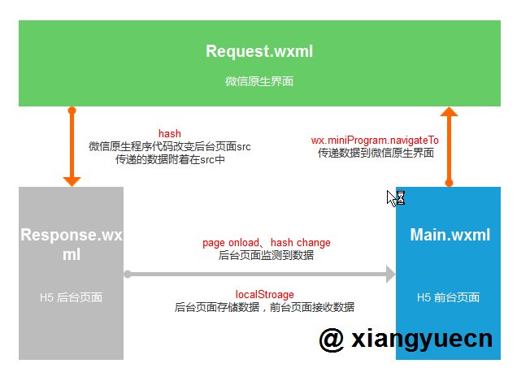

> HTML+CSS是历史悠久、超高自由度、控制精准、表现能力极强、编码简单、学习门槛超低、真跨平台的一种UI界面开发方式。
> 
> 本文介绍的是微信小程序和H5混合开发的一种数据交互方式。

## 很多应用在原生界面中混杂着HTML界面

记得xp时代的QQ，有些界面偶尔会弹出熟悉的js错误对话框，还能右键弹出熟悉的IE6的右键菜单，伪装的挺好，差点没认出来，现在的QQ就不知道了。

美团、淘宝这些拥有几乎无限界面的手机App，顶部进度条一亮，这是一个H5 没谁了！

Electron！好嗨哟~

## 数据交互

使用了HTML作界面，那么和原生程序之间的数据交互基本上是少不了的~（仅仅当做浏览器性质来用的就算了）~。

如原生程序要控制H5界面变化，就需要由原生程序传出数据到H5。

如H5界面用户点击动作触发涉及原生程序业务逻辑的调用，就需要由H5传入数据到原生程序。

这两种数据传输组合在一起就成了交互。在自行嵌入浏览器内核、Electron都可以有自己的接口实现，Android、水果~（滑稽，本文与此物种无关，下同）~都有成熟的解决方案。

## Hybrid App 与 Hybrid 小程序

Hybrid App并非一定是和H5的混合开发，但本文所说的专指H5。同一界面，编写一次代码，就能同时运行在Android、水果、浏览器之上，说没有诱惑力是假的。

小程序并非一定指的的某家的小程序，但本文所说的专指微信小程序。拥有一个强大的流量入口，嗯，就只这一点 ~（看好PWA）~。

自从微信小程序开放了`webview`，和Hybrid App就有了共性，然后生了个“Hybrid 小程序”，是我一个人这么叫吗？我不管，我就要叫！

然鹅，开发者对小程序底层的话语权几乎为0，小程序给什么我们就吃什么，嗯，真香。虽然提供了`webview`，但未提直接的供交互手段（记得要双向才能算交互吗，单向传递数据一边玩球）。

似乎Hybrid之路已然折戟。

## Hybrid 小程序数据交互

终极手段，合理合法！

> 注：发现有人采用的是`websocket`来实现的数据交互，原生小程序和H5都通过服务器来中转数据，点评：这也是个好办法。

### 数据传入
基本原理：H5使用`wx.miniProgram.navigateTo`传递数据给小程序原生程序代码。

### 数据传出
基本原理：通过改变`webview` `src`中的`hash`，来实现无刷新数据传入原生小程序。最初开放`webview`时可用，后面有版本不行了，改变`src`中任意字符会导致重新加载界面，神奇的是现在又恢复了改变`hash`不会刷新。

升级版：通过改变后台`webview` `src`中的`hash`，实现数据传入我们后台页面，不管有没有重新加载，`hash`始终能被我们的H5代码接收（而且省去了处理url变化的问题）。然后由后台页面传输数据给前台页面。

## 实战

举个支付吧，点击H5内的支付按钮，执行完业务逻辑，支付条件准备完毕，现在需要调起微信支付。

### 小程序启动

1. 小程序启动。
2. 启动`Response.wxml`，`webview`加载后台页面。
3. 启动`Main.wxml`，保留`Response.wxml`后台页面在后台运行，前台主界面加载页面。启动完毕。

### 开始支付
1. 主界面请求`jssdk` `wx.miniProgram.navigateTo`接口向`Request.wxml`界面发起请求，`path`中携带请求数据。
2. `Request.wxml`原生程序接收到请求，发现支付请求并不需要保留界面，立马返回上一个界面(前台主界面)；然后后台继续处理支付请求，调起微信支付。
3. 前台主界面H5此时应该是在等待`Request.wxml`的响应结果，并且微信已经弹出支付功能。
4. 用户支付完成，`Request.wxml`残留代码收到支付响应结果，立马通知`Response.wxml`修改后台页面`src`中的`hash`，响应结果数据包含在其中。
5. 后台页面监听到`hash change`事件，或 页面刚刚加载完毕事件。从`hash`中拿到响应数据。
6. 后台页面把响应数据写入`localStroage`，前台页面监听到`localStroage`数据。成功得到支付响应数据。

### 问题缺陷

第2步虽然立即返回了，但还是会有一个短暂的界面切换动画，不过这种数据交互本来就是重量级的，也不可能频繁调用，Android和水果都是一样的，所以用户体验就是这么可观。

改变`webview` `src` `hash`产生的行为是不可预测的 ，任性的版本，如果会刷新页面，延迟会比较大，甚至导致两次调用之间相互覆盖结果。

## 应用案例

笔者最近开发的小程序《祝福贺卡助手》，主功能采用的纯web网页，底层和微信小程序的数据交互就是本文介绍的这套模式。有2个比较重要的交互接口，一个是获取用户数据、另外一个是调起分享；当然还有一堆其他辅助类的接口。

### 扫码体验
网页版：

小程序版：

**界面和功能开发一遍，网页、小程序通吃~ 这就是Hybrid小程序的魅力！**

-------

围绕着小程序《祝福贺卡助手》的开发和审核上线过程，对于其中一些有趣的东西，我会分享出来。

下篇内容预告：Hybrid小程序混合开发之路 - H5录音和水果的对抗。

